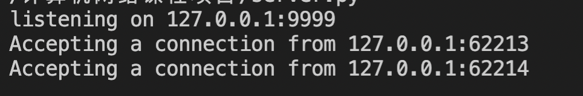
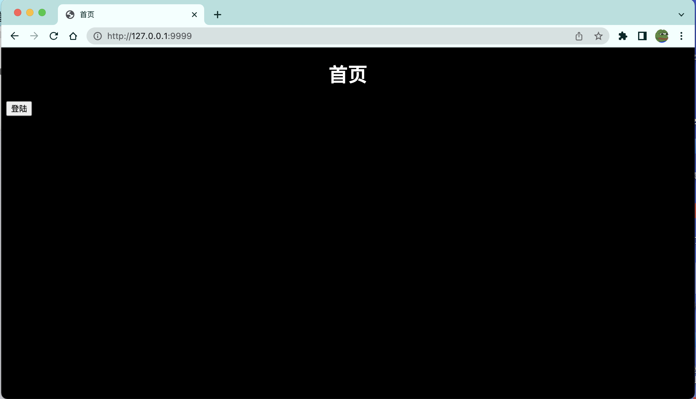
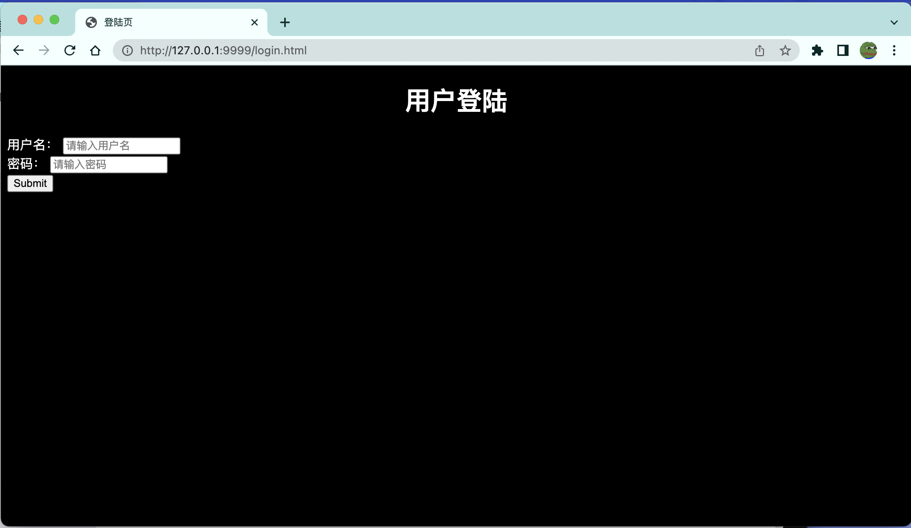
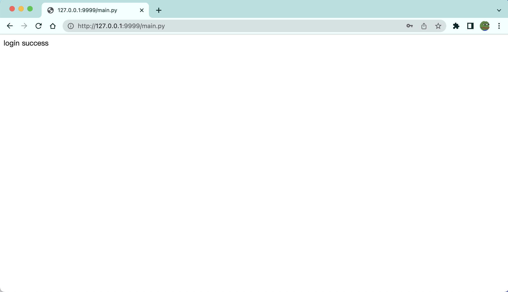
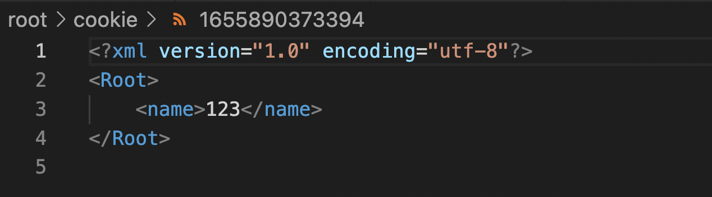

# 课程项目说明

### 1. 项目概述

本项目是一个基于python的http服务器，其主要功能有：

1. 接受html静态请求
2. 接受python脚本请求
3. 提供`Session`服务
4. 记录cookie
5. 使用线程池来管理请求

文件结构：

1. `server.py`为服务器，`HttpHead.py`为处理请求的程序
2. `root`文件夹中存放了`html`网页文件、`main.py`登陆处理程序、记录的cookie

### 2. 运行环境配置

在python环境下运行。

### 3. 软件运行说明

启动服务器：

浏览器发送请求被成功处理：

跳转进入登陆页面：

登陆成功：

cookie记录生成：

错误请求404页面跳转：

